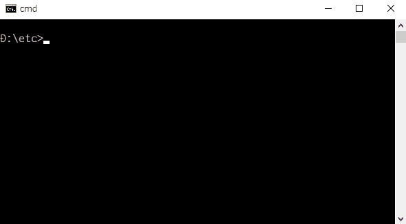

gorearrange
=====

# Overview
This is a CLI tool to interactively rearrange a text data on a terminal.

# Demo
## Ubuntu16.04

## Windows10

# Description
Since I couldn't find CLI tools for manually rearranging text data, I created this CLI tool. For this, at first, I created [a Golang library go-rearrange](https://github.com/tanaikech/go-rearrange/).

# Install
Download an executable file from [the release page](https://github.com/tanaikech/gorearrange/releases) and put to a directory with path.

or

Use go get.

~~~bash
$ go get -u github.com/tanaikech/gorearrange
~~~

This CLI tool uses [termbox-go](https://github.com/nsf/termbox-go) and [go-rearrange](https://github.com/tanaikech/go-rearrange/).

# Usage
Basically, you can use gorearrange as follows.

~~~
$ cat sample.txt | gorearrange
~~~

You can use the standard output ``>`` to output the result as a file. If you use the command prompt on windows dos, please use ``type sample.txt | gorearrange``.

or

~~~
$ gorearrange -i sample.txt
~~~

For example, if you use msys2, you can use ``winpty gorearrange -i sample.txt``. You can use an option ``-o outputfile`` to output the result as a file.

## Help
~~~
$ gorearrange help
~~~

### Keys for rearranging
Use up, down, page up, page down, home, end, enter, back space, Ctrl + c and escape keys.

- **Up** and **Down** are used for moving one line.
- **Page up** and **Page down** are used for moving several lines.
- **Home** and **End** are used for moving top and bottom of data.
- **Enter** is used for selecting a value to rearrange.
- **Back space** is used for reset the rearranged data.
- **Ctrl + c** and **Escape** are used for finishing rearranging.

# Update History
* v1.0.0 (October 15, 2017)

    Initial release.

* v1.0.1 (October 16, 2017)

    - As one of outputs, **indexmode (bool)** was added. If this is true, the rearranged result is output as the change of index for the source data. For example, if the source data and rearranged data are ``["a", "b", "c"]`` and ``["c", "b", "a"]``, respectively. The output will become ``[2, 1, 0]``.

[TOP](#TOP)
